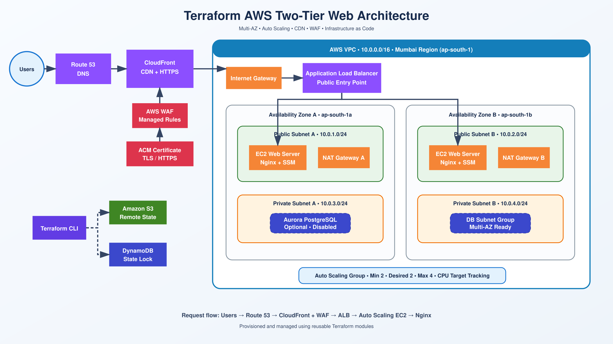

# Terraform AWS Two-Tier Web Architecture

A scalable AWS web architecture provisioned using Terraform.

## Architecture



```text
User → Route 53 → CloudFront + WAF → ALB → Auto Scaling EC2
```

## AWS Services

* VPC with public and private subnets
* Internet Gateway and NAT Gateways
* Application Load Balancer
* EC2 Auto Scaling
* CloudFront and AWS WAF
* Route 53 and ACM certificate
* IAM role with Systems Manager
* S3 remote state and DynamoDB locking
* Optional Aurora PostgreSQL module

## Deploy

```bash
terraform init
terraform plan -var-file="variables.tfvars"
terraform apply
```

## Destroy

```bash
terraform destroy -var-file="variables.tfvars"
```

## Note

Aurora is disabled by default because AWS Free Plan accounts require Express Configuration, which is not currently supported by the Terraform AWS provider.

## Author

**Arul Kumar**
Cloud & DevOps Engineer
