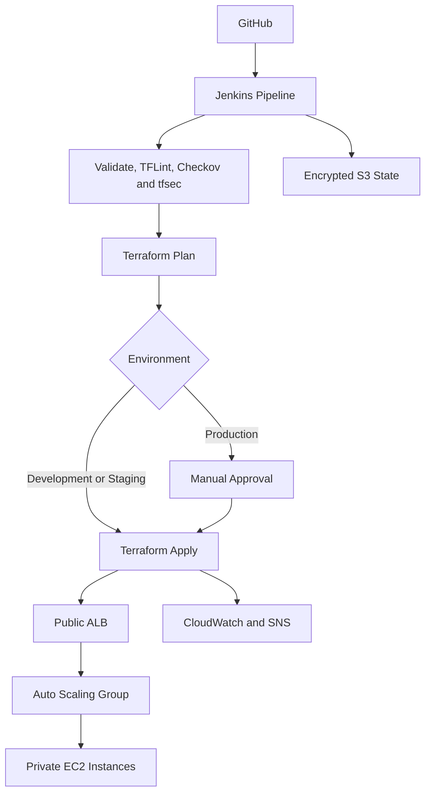
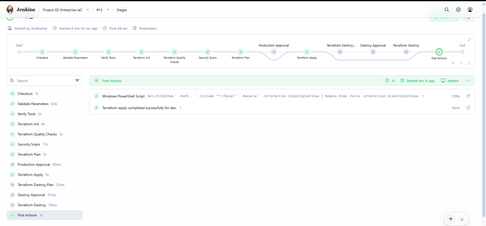
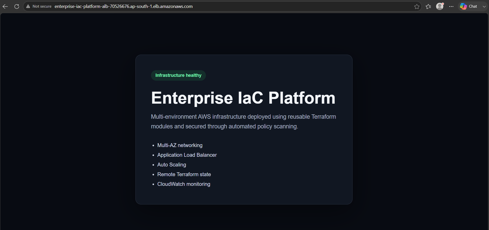
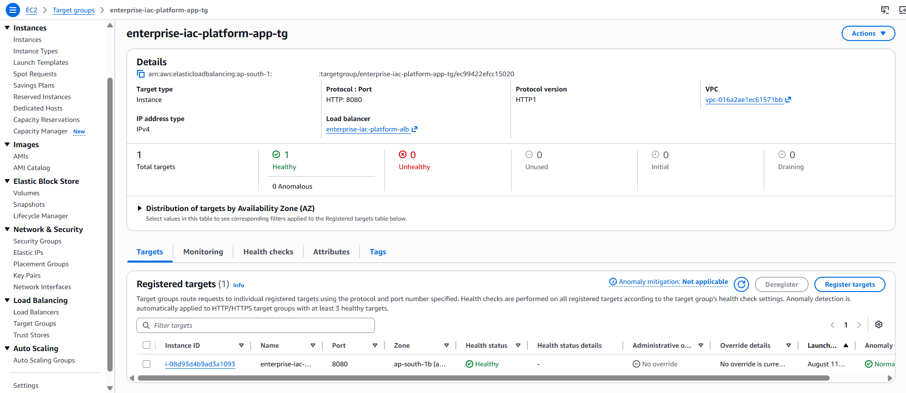
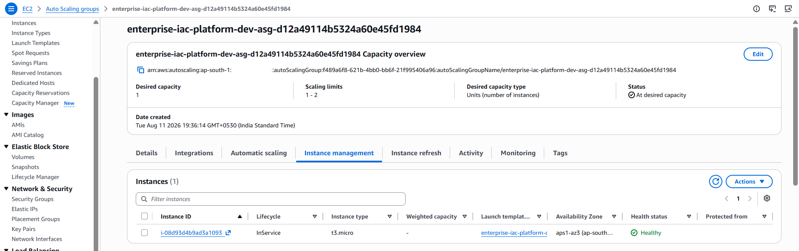
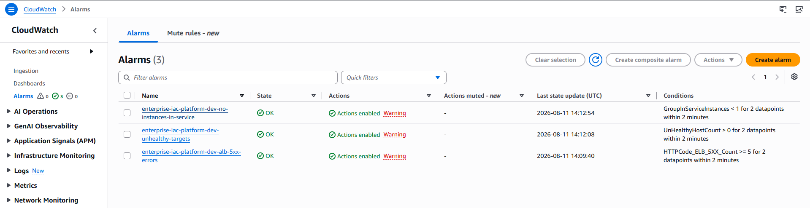
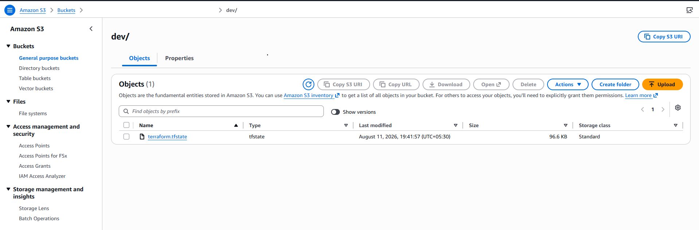
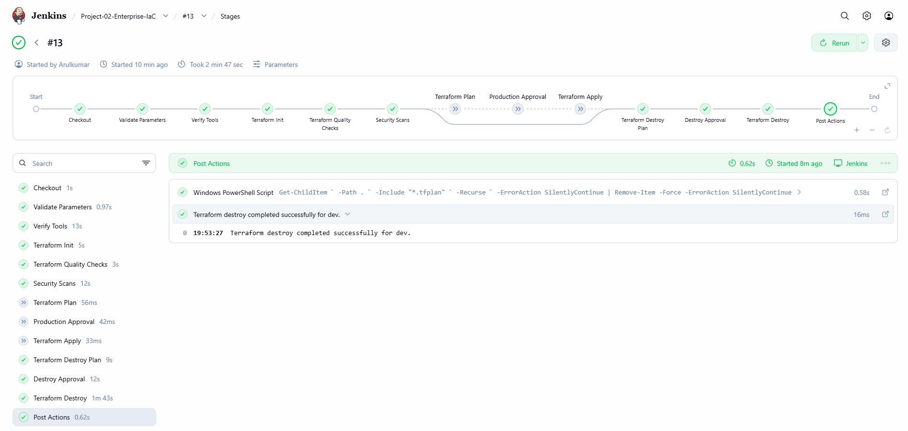

# Enterprise Multi-Environment IaC Platform

A production-style AWS Infrastructure as Code platform built with Terraform and Jenkins to provision, validate and manage isolated development, staging and production environments.

The project demonstrates reusable Terraform modules, secure remote state, automated security scanning, CI/CD quality gates, manual production approval, monitoring and controlled infrastructure destruction.

## Project Overview

| Area | Implementation |
|---|---|
| Cloud | AWS |
| Infrastructure as Code | Terraform |
| CI/CD | Jenkins Declarative Pipeline |
| Environments | Development, Staging and Production |
| Remote State | Encrypted and versioned Amazon S3 |
| State Locking | Native S3 lock file |
| Security Scanning | Checkov and tfsec |
| Code Quality | Terraform Format, Validate and TFLint |
| Compute | EC2 Launch Template and Auto Scaling Group |
| Networking | VPC, public/private subnets and security groups |
| Traffic | Application Load Balancer |
| Monitoring | CloudWatch alarms and encrypted SNS topic |

## Architecture



## Business Scenario

An organization needs a consistent and secure method to deploy AWS infrastructure across multiple environments.

Manual provisioning creates configuration drift, inconsistent security controls and limited deployment visibility. This platform solves those problems by:

- Defining infrastructure as reusable Terraform modules
- Separating development, staging and production configurations
- Running automated quality and security checks
- Requiring approval before production deployment
- Storing Terraform state securely and centrally
- Monitoring infrastructure health using CloudWatch
- Supporting controlled deployment and destruction through Jenkins

## Infrastructure Design

The platform provisions:

- Environment-specific VPC
- Public subnets for the Application Load Balancer
- Private subnets for EC2 application instances
- Internet Gateway and route tables
- Restricted security groups
- IAM role and EC2 instance profile
- EC2 Launch Template with IMDSv2
- Multi-AZ Auto Scaling Group
- Application Load Balancer and target group
- CloudWatch health alarms
- Encrypted SNS notification topic

Application instances have no public IP addresses and accept application traffic only from the ALB security group.

## Environment Strategy

| Environment | Purpose | Deployment Control |
|---|---|---|
| Development | Infrastructure testing | Automated after validation |
| Staging | Pre-production verification | Controlled pipeline execution |
| Production | Production configuration | Manual approval required |

Each environment uses an independent VPC CIDR, resource naming convention, capacity configuration and remote-state key.

```text
dev/terraform.tfstate
staging/terraform.tfstate
production/terraform.tfstate
```

## Jenkins Pipeline

```text
Checkout
  → Validate Parameters
  → Verify Tools
  → Terraform Init
  → Terraform Format and Validate
  → TFLint
  → Checkov and tfsec
  → Terraform Plan
  → Production Approval
  → Terraform Apply
  → Post-build Cleanup
```

The parameterized pipeline supports:

- `validate`
- `plan`
- `apply`
- `destroy`

Infrastructure destruction requires a separate destroy plan and manual approval.

## Security Controls

- AWS credentials stored in Jenkins Credentials
- No credentials or secrets committed to Git
- Encrypted and versioned S3 remote state
- Native Terraform state locking
- S3 public-access blocking
- TLS-only access to the state bucket
- EC2 instances deployed without public IP addresses
- IMDSv2 enforced in the Launch Template
- Explicit security-group ingress and egress rules
- Restricted VPC default security group
- IAM roles used instead of EC2 access keys
- Checkov and tfsec security gates
- Manual production approval
- Manual destruction approval
- Environment-specific security policies

Development exceptions are maintained in centralized policy files. Production configuration uses stricter security requirements, including HTTPS with ACM.

## Repository Structure

```text
.
├── application/              # Application and EC2 bootstrap template
├── bootstrap/                # Secure S3 backend provisioning
├── environments/
│   ├── dev/
│   ├── staging/
│   └── production/
├── modules/
│   ├── alb/
│   ├── compute/
│   ├── iam/
│   ├── monitoring/
│   ├── security/
│   └── vpc/
├── security/                 # Checkov and tfsec policies
├── docs/screenshots/         # Deployment evidence
├── Jenkinsfile
└── README.md
```

## Deployment Evidence

### Jenkins Apply Pipeline



### Application Through the ALB



### Healthy Target



### Auto Scaling Instance



### CloudWatch Monitoring



### S3 Remote State



### Controlled Destruction



## Validation Completed

The development environment was successfully:

1. Initialized using the S3 remote backend
2. Validated using Terraform and TFLint
3. Scanned using Checkov and tfsec
4. Planned and deployed through Jenkins
5. Accessed through the Application Load Balancer
6. Verified as healthy in the target group
7. Monitored through CloudWatch alarms
8. Destroyed through an approved Jenkins workflow

## Key Engineering Decisions

- Reusable modules reduce duplication between environments.
- Separate state keys prevent cross-environment state conflicts.
- Private EC2 instances reduce direct internet exposure.
- CI/CD security gates prevent unsafe Terraform changes from reaching deployment.
- Production and destroy approvals protect critical infrastructure.
- Remote state allows failed deployments to be safely retried.
- Development resources are destroyed after testing to control AWS costs.

## Current Status

| Environment | Status |
|---|---|
| Development | Deployed, verified and destroyed successfully |
| Staging | Configuration prepared and validated |
| Production | Configuration prepared; requires ACM certificate and approval |
| S3 Backend | Retained for future Terraform operations |

## Skills Demonstrated

Terraform · AWS · Jenkins · Infrastructure as Code · CI/CD · Git · IAM · VPC · EC2 · Auto Scaling · ALB · S3 Remote State · CloudWatch · SNS · Checkov · tfsec · TFLint