# Project 03 — Multi-Region Disaster Recovery & Automated Failover Platform

A production-inspired AWS disaster recovery platform that maintains application availability during regional or application-level failures using automated Route 53 failover, replicated infrastructure, Terraform and Ansible.

BlackTunes, a custom music web application, is used as the business workload to demonstrate Primary operation, disaster recovery, automatic failover and failback.

## Business Requirement

BlackTunes must remain accessible when its Primary AWS workload becomes unavailable.

The solution provides:

- Primary workload in Mumbai
- Disaster Recovery workload in Hyderabad
- Automated DNS failover using Route 53
- Automatic failback after Primary recovery
- Application Load Balancing and Auto Scaling
- Cross-region S3 replication
- RDS backup protection
- CloudWatch monitoring
- Infrastructure provisioning using Terraform
- Server configuration and deployment using Ansible

## Architecture

[View the complete architecture and recovery flow](docs/architecture.md)

| Component | Primary Environment | DR Environment |
|---|---|---|
| AWS Region | Mumbai — `ap-south-1` | Hyderabad — `ap-south-2` |
| Networking | Independent VPC and subnets | Independent VPC and subnets |
| Traffic | Primary ALB | Secondary ALB |
| Compute | EC2 Auto Scaling Group | EC2 Auto Scaling Group |
| Application | BlackTunes Primary | BlackTunes Disaster Recovery |
| Database | RDS MySQL | AWS Backup recovery configuration |
| Object Storage | Primary S3 bucket | Cross-region replica bucket |
| Monitoring | CloudWatch alarms | ALB and EC2 health monitoring |
| Routing | Route 53 Primary record | Route 53 Secondary record |
| Configuration | Ansible | Ansible |

## Technology Stack

- AWS
- Terraform
- Route 53
- Application Load Balancer
- EC2
- Auto Scaling
- RDS MySQL
- S3 Cross-Region Replication
- AWS Backup
- Secrets Manager
- CloudWatch
- IAM
- Ansible
- Nginx
- Gunicorn
- Flask
- Python
- PowerShell
- Git and GitHub

## Solution Workflow

### Normal Operation

1. Users access `dr.blacktunes.in`.
2. Route 53 checks the health of the Primary endpoint.
3. Healthy traffic is directed to the Mumbai ALB.
4. The ALB forwards requests to the Primary BlackTunes instance.
5. Nginx proxies application requests to Gunicorn and Flask.

### Failure Detection

1. The Primary Nginx service is stopped to simulate failure.
2. The ALB `/health` check begins failing.
3. Route 53 marks the Primary endpoint unhealthy.
4. The Primary DNS record is removed from the response.

### Automatic Failover

1. Route 53 returns the Secondary record.
2. User traffic moves to the Hyderabad ALB.
3. The DR BlackTunes application serves user requests.
4. The application displays `DISASTER RECOVERY` and `ap-south-2`.

### Automatic Failback

1. The Primary application is restored using Ansible.
2. The Primary ALB target becomes healthy.
3. Route 53 marks the Primary endpoint healthy.
4. Traffic automatically returns to Mumbai.
5. The application displays `PRIMARY` and `ap-south-1`.

## Infrastructure as Code

Terraform provisions the complete platform using reusable modules.

The infrastructure is separated into:

- `bootstrap` — Terraform remote-state foundation
- `primary` — Mumbai infrastructure
- `dr` — Hyderabad disaster recovery infrastructure
- `global` — Route 53 failover configuration
- `modules` — Reusable infrastructure components

Terraform state is stored in an encrypted and versioned S3 bucket.

Backend configuration is generated automatically to avoid manually hardcoding:

- AWS account ID
- State bucket name
- Resource identifiers
- Environment state paths

## Configuration Management

Ansible performs the following operations:

- Installs Nginx, Python, Gunicorn and required packages
- Creates a restricted BlackTunes service account
- Deploys the application files
- Creates a Python virtual environment
- Installs application dependencies
- Configures a systemd service
- Configures Nginx as a reverse proxy
- Enables services during system startup
- Validates the `/health` endpoint
- Confirms that Nginx and BlackTunes are active
- Deploys identical configurations to Primary and DR servers

## BlackTunes Application

BlackTunes is a custom music-platform workload created to demonstrate the disaster recovery solution.

Application capabilities include:

- Responsive dark and violet interface
- Music catalogue
- Track, artist and album search
- Genre filtering API
- Individual track API
- Playback-event API
- Favourites interaction
- Simulated music player controls
- Health endpoint
- Readiness endpoint
- Platform-status endpoint
- Visible environment and AWS region

> The music player demonstrates application behaviour using catalogue metadata. The project does not distribute copyrighted audio.

## Application Endpoints

| Endpoint | Purpose |
|---|---|
| `/` | BlackTunes web interface |
| `/health` | ALB and Route 53 health check |
| `/ready` | Application readiness check |
| `/status` | Platform and deployment information |
| `/api/tracks` | Music catalogue API |
| `/api/tracks/<id>` | Individual track information |
| `/api/events` | Playback-event processing |

## Repository Structure

```text
Project-03-Multi-Region-Disaster-Recovery-Automated-Failover/
├── ansible/
│   ├── group_vars/
│   ├── inventory/
│   ├── roles/
│   │   └── application/
│   ├── ansible.cfg
│   ├── site.yml
│   └── dr-site.yml
├── application/
│   ├── static/
│   │   ├── css/
│   │   └── js/
│   ├── templates/
│   ├── app.py
│   └── requirements.txt
├── docs/
│   ├── architecture.md
│   └── screenshots/
├── scripts/
├── terraform/
│   ├── bootstrap/
│   ├── primary/
│   ├── dr/
│   ├── global/
│   └── modules/
├── .gitignore
└── README.md
```

## Deployment Evidence

### Primary Infrastructure Deployment

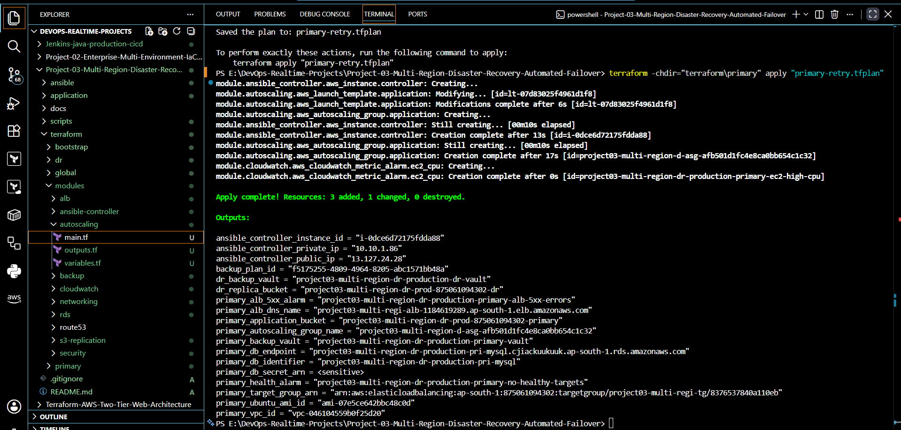

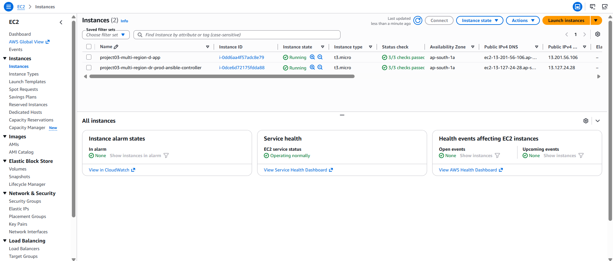

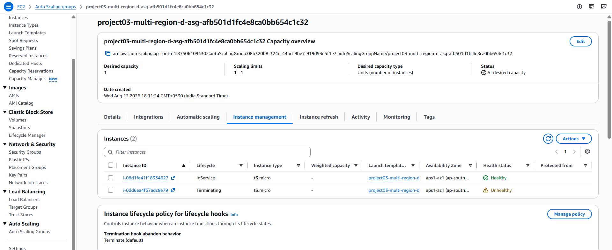

### Before Configuration Automation

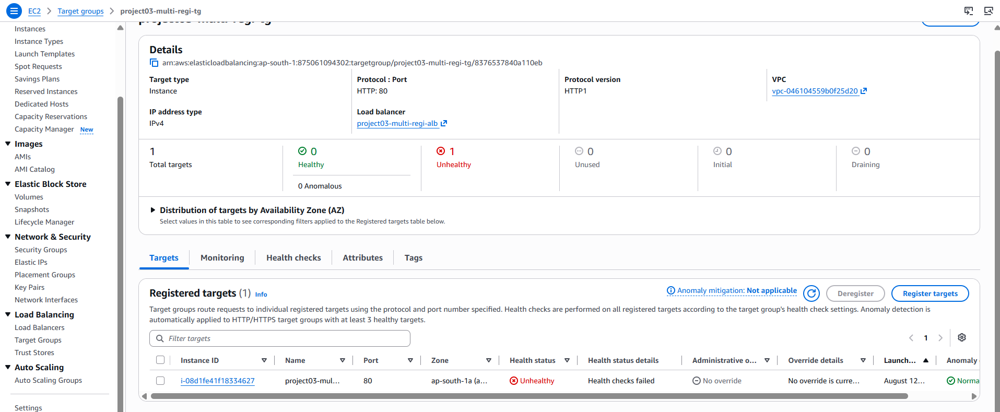

### Ansible Configuration

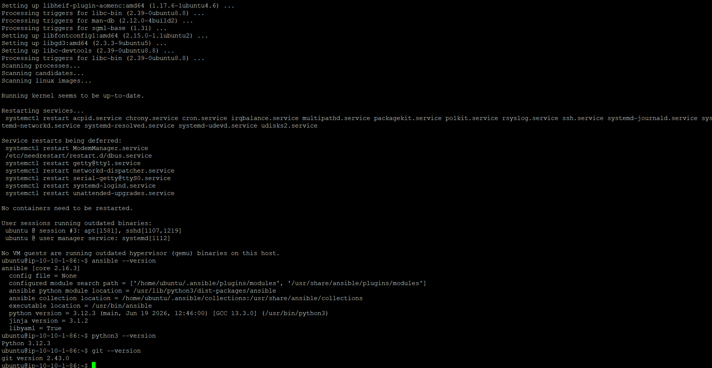

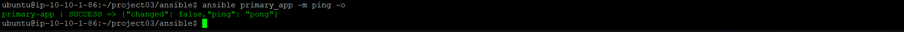

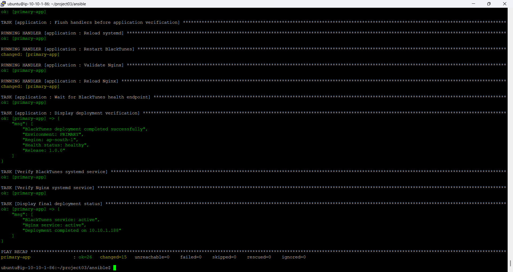

### Healthy Primary Workload

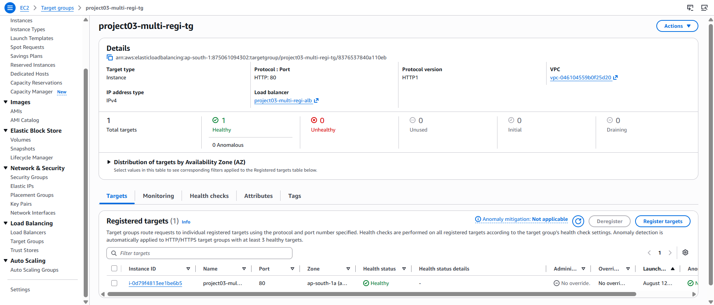

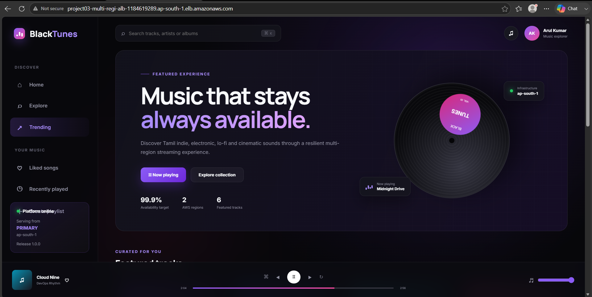

### Disaster Recovery Environment

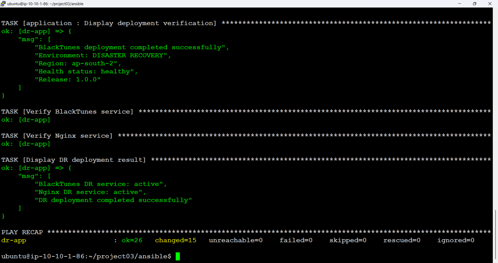

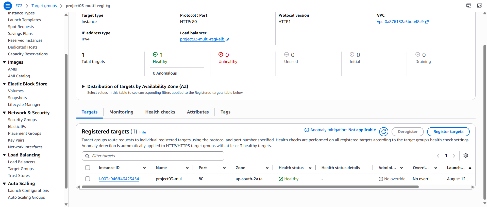

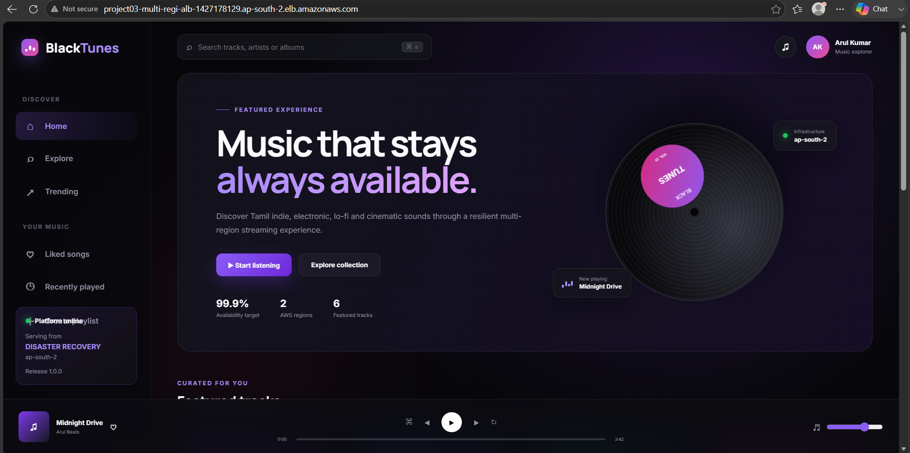

### Route 53 Failover Configuration

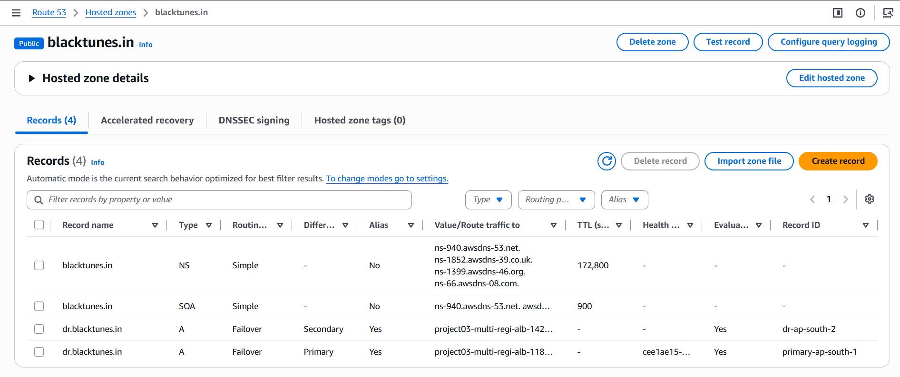

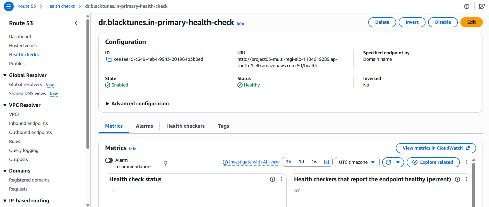

### Disaster Recovery Test

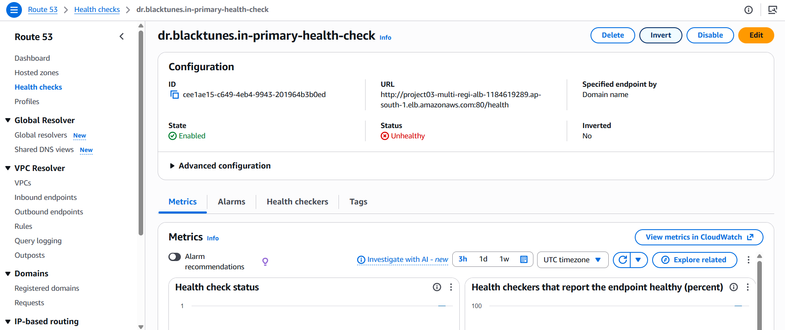

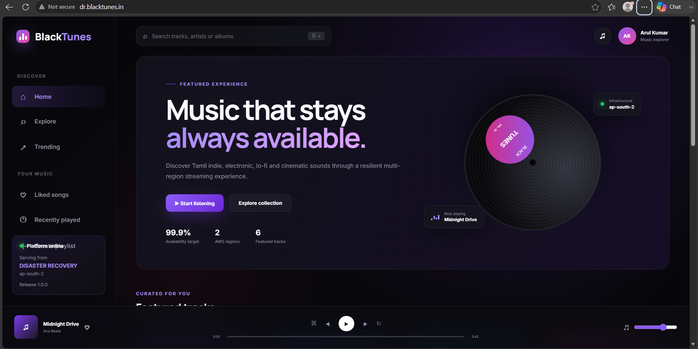

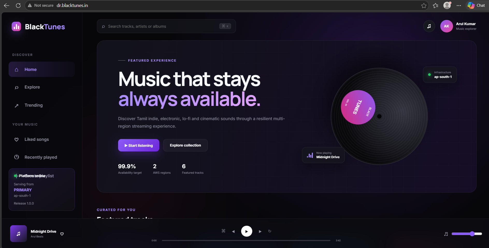

## Test Results

| Test Scenario | Result |
|---|---|
| Primary Terraform deployment | Passed |
| Primary application deployment through Ansible | Passed |
| Primary ALB target health | Passed |
| DR Terraform deployment | Passed |
| DR application deployment through Ansible | Passed |
| DR ALB target health | Passed |
| Route 53 Primary health monitoring | Passed |
| Simulated Primary application failure | Passed |
| Route 53 detected the failure | Passed |
| Automatic traffic failover to Hyderabad | Passed |
| BlackTunes served from the DR region | Passed |
| Primary application restoration | Passed |
| Automatic failback to Mumbai | Passed |
| S3 cross-region replication configuration | Implemented |
| AWS Backup cross-region configuration | Implemented |
| RDS restore execution | Not performed |

## Security Controls

- S3 Terraform state encryption
- Terraform state versioning
- S3 Block Public Access
- Application-bucket encryption
- S3 versioning and replication
- RDS storage encryption
- RDS-managed master password
- Credentials stored through AWS Secrets Manager
- RDS deployed without public access
- Application traffic accepted only from the ALB
- SSH restricted to trusted sources
- IMDSv2 required
- Encrypted EC2 root volumes
- Restricted Linux service account
- Nginx security headers
- Private keys excluded from Git
- Runtime Terraform variable files excluded from Git
- Backend configuration excluded from Git
- Ansible runtime inventory excluded from Git

## Monitoring

CloudWatch alarms monitor:

- ALB healthy host count
- ALB-generated 5XX errors
- EC2 CPU utilization
- RDS CPU utilization

Route 53 independently monitors the Primary `/health` endpoint and controls regional failover.

## Data Protection

### S3

- Versioning enabled in both regions
- Server-side encryption enabled
- Block Public Access enabled
- New objects replicated from Mumbai to Hyderabad
- Replication permissions managed through a dedicated IAM role

### RDS

- Encrypted RDS MySQL instance
- AWS-managed database credentials
- Automated RDS backups enabled
- AWS Backup plan configured
- Primary and DR backup vaults created
- Cross-region backup-copy configuration implemented

The scheduled DR vault had no completed recovery point during the short-lived test window. Therefore, this project does not claim that an RDS restoration was performed.

## Cost Controls

The platform was implemented as a short-lived portfolio environment.

Cost-control decisions include:

- Small EC2 instance types
- One application instance per region
- Small Single-AZ RDS instance
- No NAT Gateway
- Basic CloudWatch monitoring
- Short backup retention
- DR capacity limited during testing
- Resources destroyed after collecting evidence

## Challenges and Resolutions

### Incorrect EC2 Key Pair

**Problem:** Terraform initially referenced a placeholder key-pair name.

**Resolution:** The configuration was updated to use an existing regional key-pair name, and its matching PuTTY key was used for access.

### Auto Scaling Target Replacement

**Problem:** ELB health checks replaced an unconfigured application instance before Ansible deployment.

**Resolution:** The health-check type was temporarily changed to EC2, the application was deployed, and ELB health checks were enabled after validation.

### Ansible Inventory Became Outdated

**Problem:** Auto Scaling replaced the Primary EC2 instance, causing its private IP to change.

**Resolution:** The new instance IP was discovered through AWS CLI, the Ansible inventory was updated and BlackTunes was redeployed.

### Route 53 Did Not Fail Back Immediately

**Problem:** Route 53 continued serving the DR region because the replacement Primary server did not yet contain the application.

**Resolution:** BlackTunes was redeployed through Ansible, the Primary target returned to a healthy state and Route 53 automatically failed back.

### DNS Resolution Failure

**Problem:** Terraform temporarily failed to resolve AWS regional service endpoints.

**Resolution:** Windows DNS was refreshed, connectivity was validated and Terraform was safely retried using remote state.

## Lessons Learned

- Disaster recovery must test failure, routing transition, recovery and failback.
- EC2 health does not guarantee application health.
- Auto Scaling replacement instances require automated application configuration.
- Ansible inventories based on dynamic instances must be refreshed.
- Route 53 failback occurs only after the Primary application becomes healthy.
- RTO and RPO claims must be supported by actual test evidence.
- Cross-region backups and replicas increase resilience but also introduce cost.
- Terraform remote state protects consistency across independent environments.

## Known Limitations

- HTTP was used for the temporary lab deployment.
- Production implementation should use ACM certificates and HTTPS listeners.
- RDS was Single-AZ to reduce cost.
- RDS recovery was configured but not executed.
- The Ansible inventory used runtime IP addresses.
- A production implementation should use AWS Systems Manager or dynamic inventory.
- ALB access logging and deletion protection were disabled for the temporary environment.
- The DR environment ran one instance during testing rather than staying scaled to zero.

## Production Improvements

For a full production implementation:

- Add HTTPS using ACM
- Store application servers in private subnets
- Use NAT Gateways or VPC endpoints
- Use AWS Systems Manager instead of public SSH
- Use dynamic Ansible inventory
- Build an immutable AMI using Packer
- Trigger configuration automatically during instance launch
- Enable ALB access logging
- Enable deletion protection
- Use Multi-AZ RDS
- Implement Aurora Global Database or an RDS cross-region replica
- Add SNS notifications
- Add AWS WAF
- Add centralized CloudWatch dashboards
- Perform scheduled DR recovery exercises

## Deployment Commands

### Bootstrap

```powershell
terraform -chdir="terraform\bootstrap" init
terraform -chdir="terraform\bootstrap" validate
terraform -chdir="terraform\bootstrap" apply
```

### Primary Environment

```powershell
terraform -chdir="terraform\primary" init -backend-config="backend.hcl"
terraform -chdir="terraform\primary" validate
terraform -chdir="terraform\primary" plan
terraform -chdir="terraform\primary" apply
```

### Disaster Recovery Environment

```powershell
terraform -chdir="terraform\dr" init -backend-config="backend.hcl"
terraform -chdir="terraform\dr" validate
terraform -chdir="terraform\dr" plan
terraform -chdir="terraform\dr" apply
```

### Route 53 Failover

```powershell
terraform -chdir="terraform\global" init -backend-config="backend.hcl"
terraform -chdir="terraform\global" validate
terraform -chdir="terraform\global" plan
terraform -chdir="terraform\global" apply
```

## Cleanup

Destroy the environments in dependency order:

```powershell
terraform -chdir="terraform\global" destroy
terraform -chdir="terraform\dr" destroy
terraform -chdir="terraform\primary" destroy
```

The bootstrap state bucket must be retained until the other Terraform environments are completely destroyed.

## Author

**Arul Kumar**

Aspiring Cloud/DevOps Engineer focused on AWS infrastructure, automation, reliability and disaster recovery.